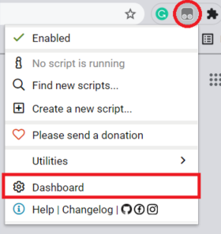
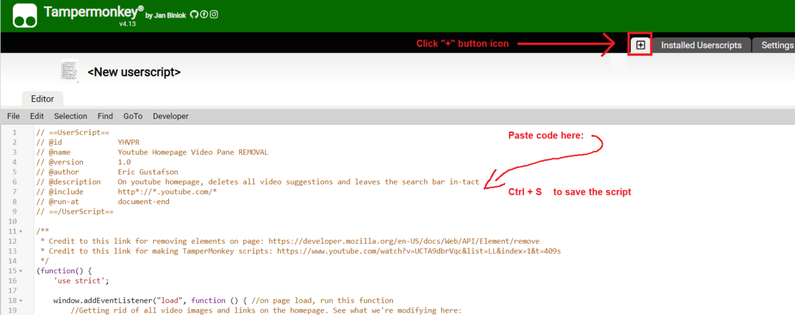
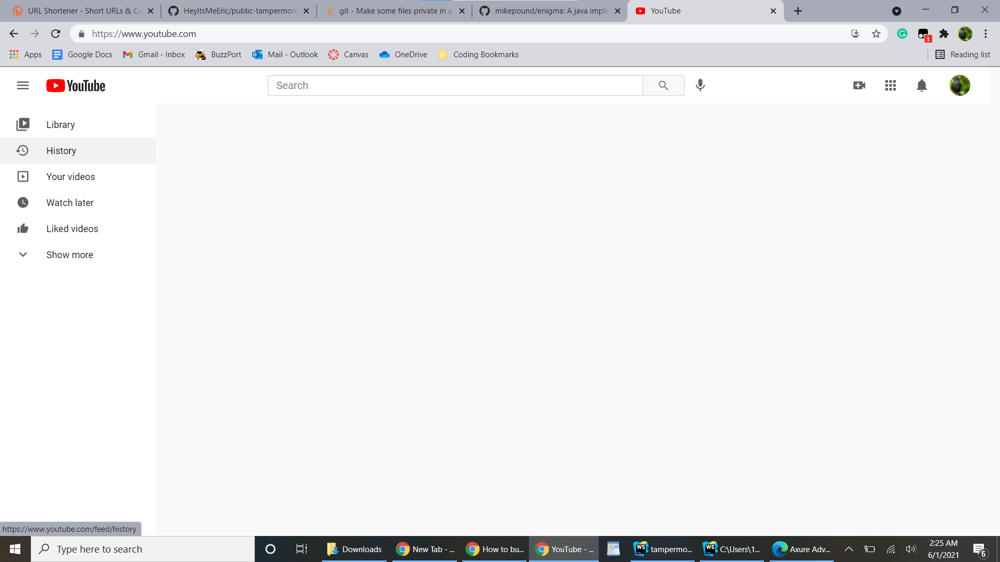
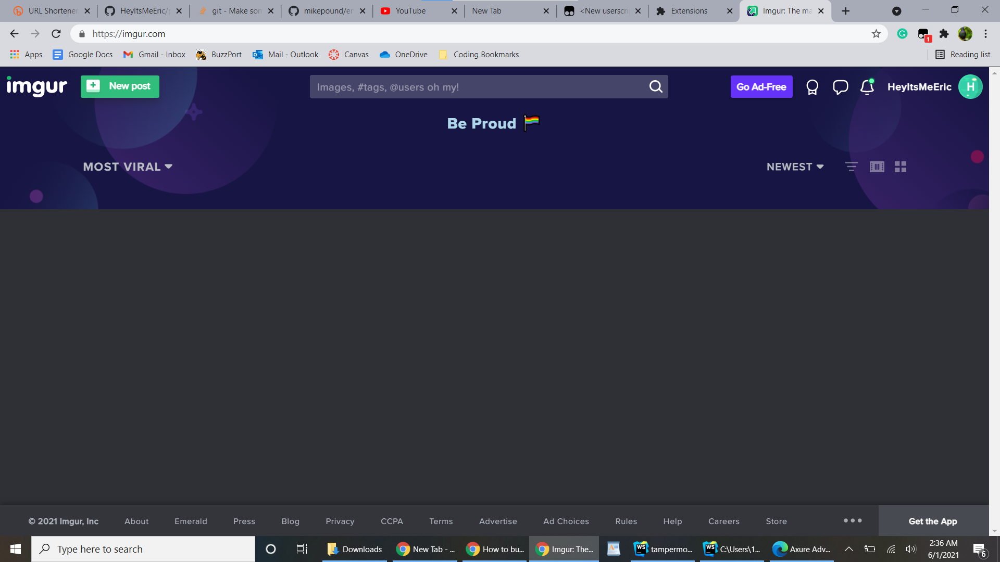

# Tampermonkey-scripts
Helpful scripts for increasing productivity and ad-blocking. [Tampermonkey](<https://chrome.google.
com/webstore/detail/tampermonkey/dhdgffkkebhmkfjojejmpbldmpobfkfo?utm_source=chrome-ntp-icon>) is a userscript 
manager that has the ability to change the "layout of a page, add or remove new functionality and content, or 
automate actions." Note that while Tampermonkey itself is not dangerous, downloading or taking code from any source 
on the internet and pasting it into tampermonkey to use is risky. The code in this repository is pretty simple 
(sometimes completely commented throughout), and links to where I learned certain things are present if applicable. 
Use this Chrome extension at your own risk.

These scripts also take 1-2 seconds to work their magic once the target webpage has loaded.

## From this repository to your Tampermonkey
To use any of the userscripts in this repository, simply copy the entire file and paste it into a new script in 
Tampermonkey:

1.) Click on the Tampermonkey icon in the top right hand corner (may not be present; if not, click on the puzzle 
piece to the right of this icon and select Tampermonkey from there)

2.) Click on the "+" button to create a new script, and then paste the code from whichever userscript in this 
repository you'd like.

***
***

### Youtube Homepage Content Blocker
Youtube is a very useful site for learning and taking it back a notch. When you load up youtube.com, you are met 
with a panel of videos that are recommended by the Youtube algorithm that can oftentimes lead you on a rabbit-hole 
and before you know it you've wasted hours watching videos you didn't need to watch....

This userscript blocks the videos that show up on the homepage and also gets rid of some tabs on the left-hand side 
of the screen. Upon loading the homepage, this is what it will look like:

***

### Imgur Homepage Content Blocker

Similar to the Youtube Content Blocker, except for Imgur. It blocks the content on the home page:

